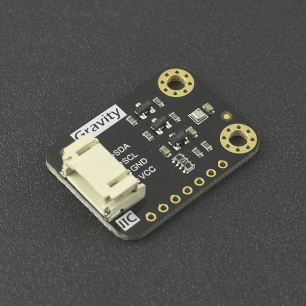

# DFRobot_BMP3XX
* [中文版](./README_CN.md)

This is a Library for BMP3XX, the function is to read temperature and pressure.
The BMP(390L/388) is a digital sensor with pressure and temperature measurement based on proven sensing principles. The 
sensor module is housed in an extremely compact 10-pin metal-lid LGA package with a footprint of only 2.0 × 2.0 mm² and 
max 0.8 mm package height. Its small dimensions and its low power consumption of 3.2 µA @1Hz allow the implementation 
in battery driven devices such as mobile phones, GPS modules or watches.




## Product Link (https://www.dfrobot.com/search-bmp3.html)
    SKU: SEN0423/SEN0371/SEN0251


## Table of Contents

* [Summary](#summary)
* [Installation](#installation)
* [Methods](#methods)
* [Compatibility](#compatibility)
* [History](#history)
* [Credits](#credits)


## Summary
* BMP(390L/388) can read temperature and pressure.
* The library supports the SPI/I2C communication.
* BMP(390L/388) also includes FIFO functionality. This greatly improves ease of use.
* Interrupts than can be used in a power efficient manner without using software algorithms.
* BMP390L is more accurate than its predecessors, covering a wide measurement range from 300 hPa to 1250 hPa.
* This new barometric pressure(BMP390L) sensor exhibits an attractive price-performance ratio coupled with low power consumption.
* Due to the built-in hardware synchronization of the sensor(BMP390L) data and its ability to synchronize data from external devices.


## Installation

To use the library, first download the library file, paste it into the directory you specified, then open the Examples folder and run the demo in that folder.


## Methods

```python

    '''!
      @brief Initialize sensor
      @return return initialization status
      @retval True indicate initialization succeed
      @retval False indicate initialization failed
    '''
    def begin(self):

    '''!
      @brief Get pressure measurement value from register, working range (300‒1250 hPa)
      @return Return pressure measurements, unit: Pa
      @attention If the reference value is provided before, the absolute value of the current 
      @n         position pressure is calculated according to the calibrated sea level atmospheric pressure
        '''
    @property
    def get_pressure(self):

    '''!
      @brief Take the given current location altitude as the reference value 
      @n     to eliminate the absolute difference for subsequent pressure and altitude data
      @param altitude Altitude in current position
      @return Pass the benchmark value successfully will return ture, if failed it will return false
    '''
    def calibrated_absolute_difference(self, altitude):

    '''!
      @brief Get pressure measurement value from register, working range (-40 ‒ +85 °C)
      @return Return temperature measurements, unit: °C
    '''
    @property
    def get_temperature(self):

    '''!
      @brief Calculate the altitude based on the atmospheric pressure measured by the sensor
      @return Return altitude, unit: m
      @attention If the reference value is provided before, the absolute value of the current 
      @n         position pressure is calculated according to the calibrated sea level atmospheric pressure
    '''
    @property
    def get_altitude(self):

    '''!
      @brief 6 commonly used sampling modes that allows users to configure easily
      @param mode:
      @n       ULTRA_LOW_PRECISION, Ultra-low precision, suitable for monitoring weather (lowest power consumption), the power is mandatory mode.
      @n       LOW_PRECISION, Low precision, suitable for random detection, power is normal mode
      @n       NORMAL_PRECISION1, Normal precision 1, suitable for dynamic detection on handheld devices (e.g on mobile phones), power is normal mode
      @n       NORMAL_PRECISION2, Normal precision 2, suitable for drones, power is normal mode
      @n       HIGH_PRECISION, High precision, suitable for low-power handled devices (e.g mobile phones), power is normal mode
      @n       ULTRA_PRECISION, Ultra-high precision, suitable for indoor navigation, its acquisition rate will be extremely low, and the acquisition cycle is 1000 ms.
      @return  return configuration results
      @retval True indicate configuration succeed
      @retval False indicate configuration failed and remains its original state
    '''
    def set_common_sampling_mode(self, mode):

    '''!
      @brief Enable or disable FIFO
      @param mode: 
      @n       True: Enable FIFO
      @n       False: Disable FIFO
    '''
    def enable_fifo(self, mode):

    '''!
      @brief Get the cached data in the FIFO
      @return Return the calibrated pressure data and the calibrated temperature data 
      @n        Temperature unit: °C; Pressure unit: Pa
    '''
    def get_fifo_temp_press_data(self):

    '''!
      @brief Get FIFO cached data size
      @return Range of return value: 0-511
    '''
    def get_fifo_length(self):

    '''!
      @brief Empty cached data in the FIFO without changing its settings  
    '''
    def empty_fifo(self):

    '''!
      @brief Reset and restart the sensor, restoring the sensor configuration to the default configuration
    '''
    def reset(self):

    '''!
      @brief Enable interrupt of sensor data ready signal
      @note As the interrupt pin is unique, the three interrupts are set to be used 
      @n    separately, please note the other two interrupt functions when using
    '''
    def enable_data_ready_int(self):

    '''!
      @brief Enable the interrupt of the sensor FIFO reaching the water level signal
      @note As the interrupt pin is unique, the three interrupts are set to be used 
      @n    separately, please note the other two interrupt functions when using
      @param wtm_value: Set the water level value of FIFO (Range: 0-511)
    '''
    def enable_fifo_wtm_int(self, wtm_value):

    '''!
      @brief Enable the interrupt of the signal that the sensor FIFO is full
      @note As the interrupt pin is unique, the three interrupts are set to be used 
      @n    separately, please note the other two interrupt functions when using
    '''
    def enable_fifo_full_int(self):

    '''!
      @brief Configure measurement mode and power mode 
      @param mode The measurement mode and power mode that need to be set:
      @n  SLEEP_MODE(Sleep mode): It will be in sleep mode by default after power-on reset. In this mode,no 
      @n                          measurement is performed and power consumption is minimal. All registers 
      @n                          are accessible for reading the chip ID and compensation coefficient.
      @n  FORCED_MODE(Forced mode): In this mode, the sensor will take a single measurement according to the selected 
      @n                            measurement and filtering options. After the measurement is completed, the sensor 
      @n                            will return to sleep mode, and the measurement result can be obtained in the register.
      @n  NORMAL_MODE(Normal mode): Continuously loop between the measurement period and the standby period. 
      @n                            The output data rates are related to the ODR mode setting.
    '''
    def set_power_mode(self, mode):

    '''!
      @brief Configure the oversampling when measuring pressure and temperature (OSR:over-sampling register)
      @details Oversampling mode of pressure and temperature measurement need to be set
      @param press_osr_set 6 pressure oversampling mode:
      @n       BMP3XX_PRESS_OSR_SETTINGS[0], Pressure sampling×1, 16 bit / 2.64 Pa (Recommend temperature oversampling×1)
      @n       BMP3XX_PRESS_OSR_SETTINGS[1], Pressure sampling×2, 16 bit / 2.64 Pa (Recommend temperature oversampling×1)
      @n       BMP3XX_PRESS_OSR_SETTINGS[2], Pressure sampling×4, 18 bit / 0.66 Pa (Recommend temperature oversampling×1)
      @n       BMP3XX_PRESS_OSR_SETTINGS[3], Pressure sampling×8, 19 bit / 0.33 Pa (Recommend temperature oversampling×2)
      @n       BMP3XX_PRESS_OSR_SETTINGS[4], Pressure sampling×16, 20 bit / 0.17 Pa (Recommend temperature oversampling×2)
      @n       BMP3XX_PRESS_OSR_SETTINGS[5], Pressure sampling×32, 21 bit / 0.085 Pa (Recommend temperature oversampling×2)
      @param temp_osr_set 6 temperature oversampling mode:
      @n       BMP3XX_TEMP_OSR_SETTINGS[0], Temperature sampling×1, 16 bit / 0.0050 °C
      @n       BMP3XX_TEMP_OSR_SETTINGS[1], Temperature sampling×2, 16 bit / 0.0025 °C
      @n       BMP3XX_TEMP_OSR_SETTINGS[2], Temperature sampling×4, 18 bit / 0.0012 °C
      @n       BMP3XX_TEMP_OSR_SETTINGS[3], Temperature sampling×8, 19 bit / 0.0006 °C
      @n       BMP3XX_TEMP_OSR_SETTINGS[4], Temperature sampling×16, 20 bit / 0.0003 °C
      @n       BMP3XX_TEMP_OSR_SETTINGS[5], Temperature sampling×32, 21 bit / 0.00015 °C
    '''
    def set_oversampling(self, press_osr_set, temp_osr_set):

    '''!
      @brief IIR filter coefficient setting(IIR filtering)
      @param iir_config_coef Set IIR filter coefficient, configurable mode:
      @n       BMP3XX_IIR_CONFIG_COEF_0, BMP3XX_IIR_CONFIG_COEF_1, BMP3XX_IIR_CONFIG_COEF_3, 
      @n       BMP3XX_IIR_CONFIG_COEF_7, BMP3XX_IIR_CONFIG_COEF_15, BMP3XX_IIR_CONFIG_COEF_31, 
      @n       BMP3XX_IIR_CONFIG_COEF_63, BMP3XX_IIR_CONFIG_COEF_127
    '''
    def filter_coefficient(self, iir_config_coef):

    '''!
      @brief Set output data rate in subdivision/sub-sampling mode (ODR:output data rates)
      @param odr_set The output data rate needs to be set, configurable mode:
      @n       BMP3XX_ODR_200_HZ, BMP3XX_ODR_100_HZ, BMP3XX_ODR_50_HZ, BMP3XX_ODR_25_HZ, BMP3XX_ODR_12P5_HZ, 
      @n       BMP3XX_ODR_6P25_HZ, BMP3XX_ODR_3P1_HZ, BMP3XX_ODR_1P5_HZ, BMP3XX_ODR_0P78_HZ, BMP3XX_ODR_0P39_HZ, 
      @n       BMP3XX_ODR_0P2_HZ, BMP3XX_ODR_0P1_HZ, BMP3XX_ODR_0P05_HZ, BMP3XX_ODR_0P02_HZ, BMP3XX_ODR_0P01_HZ, 
      @n       BMP3XX_ODR_0P006_HZ, BMP3XX_ODR_0P003_HZ, BMP3XX_ODR_0P0015_HZ
      @return return configuration results
      @retval True indicate configuration succeed
      @retval False indicate configuration failed and remains its original state
    '''
    def set_output_data_rates(self, odr_set)

```


## Compatibility

* RaspberryPi Version

| Board        | Work Well | Work Wrong | Untested | Remarks |
| ------------ | :-------: | :--------: | :------: | ------- |
| RaspberryPi2 |           |            |    √     |         |
| RaspberryPi3 |           |            |    √     |         |
| RaspberryPi4 |     √     |            |          |         |

* Python Version

| Python  | Work Well | Work Wrong | Untested | Remarks |
| ------- | :-------: | :--------: | :------: | ------- |
| Python2 |     √     |            |          |         |
| Python3 |     √     |            |          |         |


## History

- 2021/04/20 - Version 1.0.0 released.
- 2021/11/08 - Version 1.0.1 released.
- 2021/12/03 - Version 1.0.2 released.
- 2022/09/21 - Version 1.0.3 released.


## Credits

Written by qsjhyy(yihuan.huang@dfrobot.com), 2021. (Welcome to our [website](https://www.dfrobot.com/))

