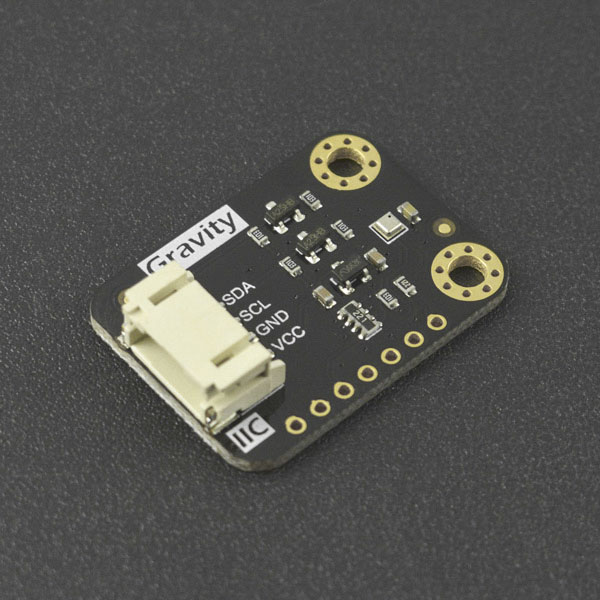
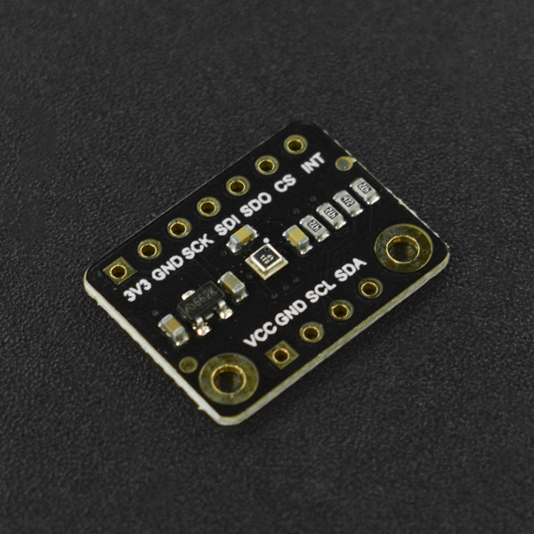

# DFRobot_BMP3XX
* [English Version](./README.md)

这是一个BMP3XX的库, 功能是读取温度和压力。
BMP(390L/388)是一款基于可靠传感原理的压力和温度测量数字传感器。
传感器模块安装在一个非常紧凑的10针金属盖LGA封装中, 占地面积仅为2.0 × 2.0 mm², 最大0.8 mm封装高度。
它的小尺寸和低功耗的3.2µA @1Hz允许实现在电池驱动的设备, 如手机, GPS模块或手表。





## 产品链接 (https://www.dfrobot.com.cn/search.php?keywords=bmp3)
    SKU: SEN0423/SEN0371/SEN0251


## 目录

* [概述](#概述)
* [库安装](#库安装)
* [方法](#方法)
* [兼容性](#兼容性)
* [历史](#历史)
* [创作者](#创作者)


## 概述
* BMP(390L/388)可读取温度和压力。
* 该库支持SPI/I2C通信。
* BMP(390L/388)也包括FIFO功能。这极大地提高了易用性。
* 中断可以在不使用软件算法的情况下以高效的方式使用。
* BMP390L比它的前辈更精确, 覆盖从300 hPa到1250 hPa的宽测量范围。
* 这款新的气压传感器(BMP390L)具有诱人的性价比和低功耗。
* 由于传感器(BMP390L)数据的内置硬件同步及其从外部设备同步数据的能力。


## 库安装

要使用库, 首先下载库文件, 将其粘贴到指定的目录中, 然后打开Examples文件夹并在该文件夹中运行演示。


## 方法

```python

    '''!
      @brief 初始化函数
      @return 返回初始化状态
      @retval True 表示初始化成功
      @retval False 表示初始化成失败
    '''
    def begin(self):

    '''!
      @brief 从寄存器获取压力测量值, 工作范围(300‒1250 hPa)
      @return 返回压力测量值, 单位是Pa
      @attention 若之前提供了基准值, 则根据校准的海平面大气压, 计算当前位置气压的绝对值
    '''
    @property
    def get_pressure(self):

    '''!
      @brief 以给定的当前位置海拔做为基准值, 为后续压力和海拔数据消除绝对差
      @param altitude 当前位置海拔高度
      @return 传入基准值成功, 返回ture, 失败返回false
    '''
    def calibrated_absolute_difference(self, altitude):

    '''!
      @brief 从寄存器获取温度测量值, 工作范围(-40 ‒ +85 °C)
      @return 返回温度测量值, 单位是℃
    '''
    @property
    def get_temperature(self):

    '''!
      @brief 根据传感器所测量大气压, 计算海拔高度
      @return 返回海拔高度, 单位m
      @attention 若之前提供了基准值, 则根据校准的海平面大气压, 计算当前位置海拔绝对高度
    '''
    @property
    def get_altitude(self):

    '''!
      @brief 让用户方便配置常用的采样模式
      @param mode:
      @n       ULTRA_LOW_PRECISION, 超低精度, 适合天气监控(最低功耗), 电源模式为强制模式
      @n       LOW_PRECISION, 低精度, 适合随意的检测, 电源模式为正常模式
      @n       NORMAL_PRECISION1, 标准精度1, 适合在手持式设备上动态检测(例如在手机上), 电源模式为正常模式
      @n       NORMAL_PRECISION2, 标准精度2, 适合无人机, 电源模式为正常模式
      @n       HIGH_PRECISION, 高精度, 适合在低功耗手持式设备上(例如在手机上), 电源模式为正常模式
      @n       ULTRA_PRECISION, 超高精度, 适合室内的导航, 采集速率会极低, 采集周期1000ms, 电源模式为正常模式
      @return  返回配置结果
      @retval True 表示配置成功
      @retval False 表示配置失败, 保持原来的配置
    '''
    def set_common_sampling_mode(self, mode):

    '''!
      @brief 启用或禁用FIFO
      @param mode: 
      @n       True: 使能 FIFO
      @n       False: 失能 FIFO
    '''
    def enable_fifo(self, mode):

    '''!
      @brief 获取FIFO中缓存的数据
      @return 返回校准的压力数据和校准的温度数据 
      @n        温度单位摄氏度, 压力单位帕
    '''
    def get_fifo_temp_press_data(self):

    '''!
      @brief 获取FIFO已缓存数据大小
      @return 返回值范围为: 0-511
    '''
    def get_fifo_length(self):

    '''!
      @brief 清除FIFO中的所有数据, 不改变FIFO配置
    '''
    def empty_fifo(self):

    '''!
      @brief 触发重置, 所有用户配置设置将被其默认状态覆盖
    '''
    def reset(self):

    '''!
      @brief 使能中断传感器数据就绪信号
      @note 由于中断引脚是唯一的, 三个中断设置为单独使用, 使用时请注释其他两个中断功能
    '''
    def enable_data_ready_int(self):

    '''!
      @brief 使能传感器FIFO达到水位信号的中断
      @note 由于中断引脚是唯一的, 三个中断设置为单独使用, 使用时请注释其他两个中断功能
      @param wtm_value:设定FIFO的水位值(范围: 0-511)
    '''
    def enable_fifo_wtm_int(self, wtm_value):

    '''!
      @brief 使能传感器FIFO水位满的中断
      @note 由于中断引脚是唯一的, 三个中断设置为单独使用, 使用时请注释其他两个中断功能
    '''
    def enable_fifo_full_int(self):

    '''!
      @brief 测量模式和电源模式的配置
      @param mode 需要设置的测量模式和电源模式:
      @n       SLEEP_MODE(Sleep mode): 开机复位后默认处于休眠模式。该模式不进行任何测量, 功耗最小。所有寄存器均可访问;可以读取芯片ID和补偿系数。
      @n       FORCED_MODE(Forced mode): 在强制模式下, 根据选择的测量和滤波选项进行单个测量。测量完成后, 传感器返回睡眠模式, 测量结果可从数据寄存器中获得。
      @n       NORMAL_MODE(Normal mode): 在测量周期和待机周期之间连续循环, 输出数据率(output data rates)与ODR模式设置有关。
    '''
    def set_power_mode(self, mode):

    '''!
      @brief  压力和温度测量的过采样配置(OSR:over-sampling register)
      @details 需要设置的压力和温度测量的过采样模式
      @param press_osr_set 6种压力过采样模式:
      @n       BMP3XX_PRESS_OSR_SETTINGS[0], 压力采样×1, 16 bit / 2.64 Pa(推荐温度过采样×1)
      @n       BMP3XX_PRESS_OSR_SETTINGS[1], 压力采样×2, 16 bit / 2.64 Pa(推荐温度过采样×1)
      @n       BMP3XX_PRESS_OSR_SETTINGS[2], 压力采样×4, 18 bit / 0.66 Pa(推荐温度过采样×1)
      @n       BMP3XX_PRESS_OSR_SETTINGS[3], 压力采样×8, 19 bit / 0.33 Pa(推荐温度过采样×2)
      @n       BMP3XX_PRESS_OSR_SETTINGS[4], 压力采样×16, 20 bit / 0.17 Pa(推荐温度过采样×2)
      @n       BMP3XX_PRESS_OSR_SETTINGS[5], 压力采样×32, 21 bit / 0.085 Pa(推荐温度过采样×2)
      @param temp_osr_set 6种温度过采样模式:
      @n       BMP3XX_TEMP_OSR_SETTINGS[0], 温度采样×1, 16 bit / 0.0050 °C
      @n       BMP3XX_TEMP_OSR_SETTINGS[1], 温度采样×2, 16 bit / 0.0025 °C
      @n       BMP3XX_TEMP_OSR_SETTINGS[2], 温度采样×4, 18 bit / 0.0012 °C
      @n       BMP3XX_TEMP_OSR_SETTINGS[3], 温度采样×8, 19 bit / 0.0006 °C
      @n       BMP3XX_TEMP_OSR_SETTINGS[4], 温度采样×16, 20 bit / 0.0003 °C
      @n       BMP3XX_TEMP_OSR_SETTINGS[5], 温度采样×32, 21 bit / 0.00015 °C
    '''
    def set_oversampling(self, press_osr_set, temp_osr_set):

    '''!
      @brief IIR滤波系数配置(IIR filtering)
      @param iir_config_coef IIR滤波系数设置, 可配置模式: 
      @n       BMP3XX_IIR_CONFIG_COEF_0, BMP3XX_IIR_CONFIG_COEF_1, BMP3XX_IIR_CONFIG_COEF_3, 
      @n       BMP3XX_IIR_CONFIG_COEF_7, BMP3XX_IIR_CONFIG_COEF_15, BMP3XX_IIR_CONFIG_COEF_31, 
      @n       BMP3XX_IIR_CONFIG_COEF_63, BMP3XX_IIR_CONFIG_COEF_127
    '''
    def filter_coefficient(self, iir_config_coef):

    '''!
      @brief 细分/二次采样的方式设置输出数据率配置(ODR:output data rates)
      @param odr_set 需要设置的输出数据率,可配置模式: 
      @n       BMP3XX_ODR_200_HZ, BMP3XX_ODR_100_HZ, BMP3XX_ODR_50_HZ, BMP3XX_ODR_25_HZ, BMP3XX_ODR_12P5_HZ, 
      @n       BMP3XX_ODR_6P25_HZ, BMP3XX_ODR_3P1_HZ, BMP3XX_ODR_1P5_HZ, BMP3XX_ODR_0P78_HZ, BMP3XX_ODR_0P39_HZ, 
      @n       BMP3XX_ODR_0P2_HZ, BMP3XX_ODR_0P1_HZ, BMP3XX_ODR_0P05_HZ, BMP3XX_ODR_0P02_HZ, BMP3XX_ODR_0P01_HZ, 
      @n       BMP3XX_ODR_0P006_HZ, BMP3XX_ODR_0P003_HZ, BMP3XX_ODR_0P0015_HZ
      @return  返回配置结果
      @retval True 表示配置成功
      @retval False 表示配置失败, 保持原来的配置
    '''
    def set_output_data_rates(self, odr_set):

```


## 兼容性

* RaspberryPi 版本

| Board        | Work Well | Work Wrong | Untested | Remarks |
| ------------ | :-------: | :--------: | :------: | ------- |
| RaspberryPi2 |           |            |    √     |         |
| RaspberryPi3 |           |            |    √     |         |
| RaspberryPi4 |     √     |            |          |         |

* Python 版本

| Python  | Work Well | Work Wrong | Untested | Remarks |
| ------- | :-------: | :--------: | :------: | ------- |
| Python2 |     √     |            |          |         |
| Python3 |     √     |            |          |         |


## 历史

- 2021/04/20 - 1.0.0 版本
- 2021/11/08 - 1.0.1 版本
- 2021/12/03 - 1.0.2 版本
- 2022/09/21 - 1.0.3 版本


## 创作者

Written by qsjhyy(yihuan.huang@dfrobot.com), 2021. (Welcome to our [website](https://www.dfrobot.com/))

